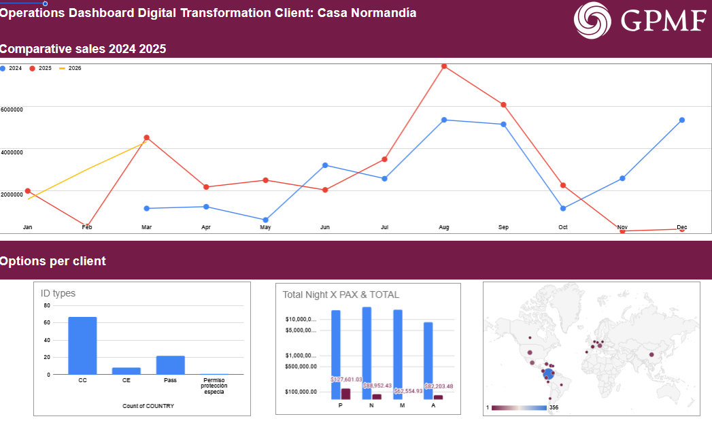
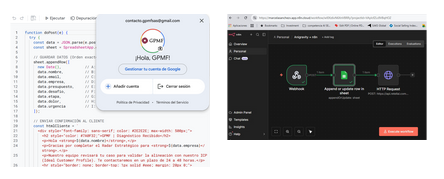
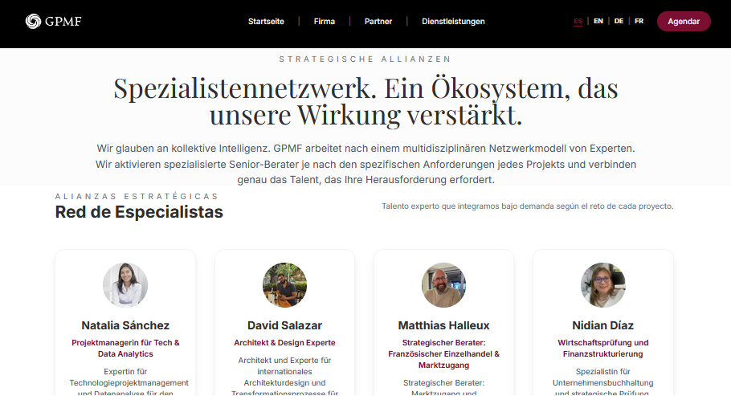
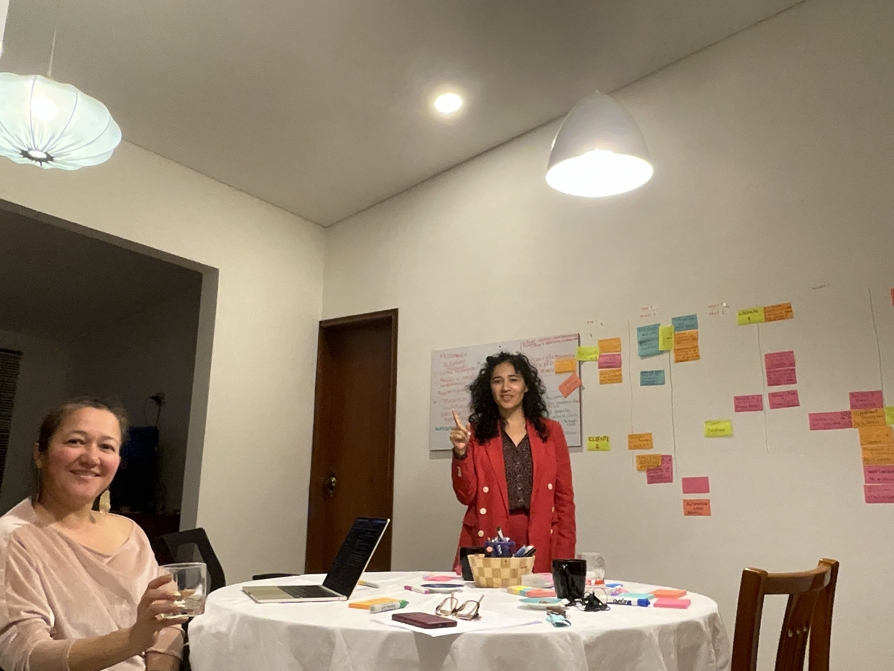
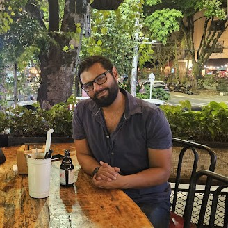
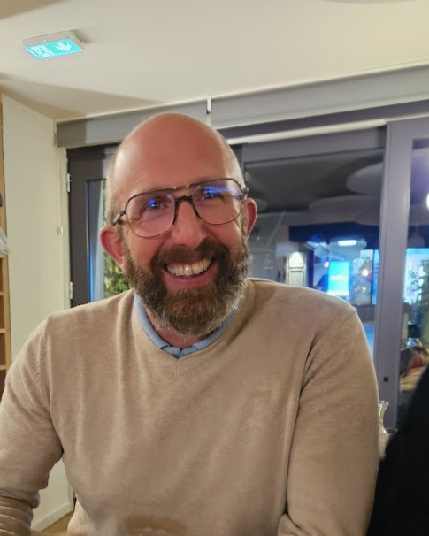
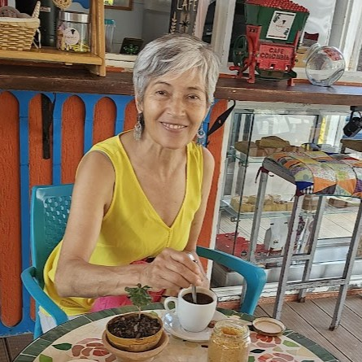
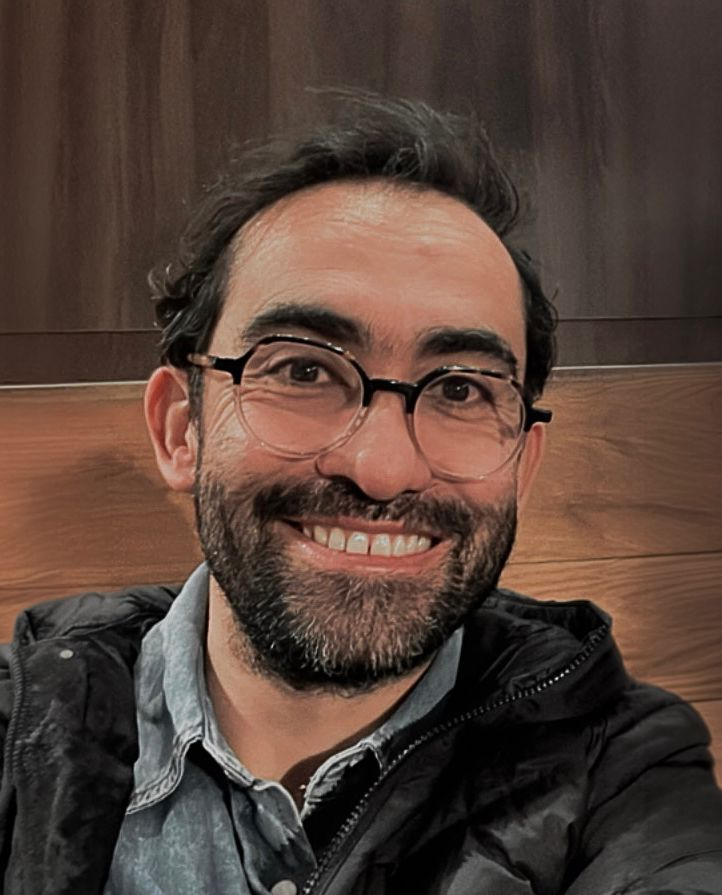

# Recopilación de Textos Legacy (Mejorado)

## === ARCHIVO: about.html ===

# Multidisciplinary DNA. Borderless.

GPMF emerges from real field experience, uniting two forces. We fuse decades of experience in Colombia, Germany, Canada and France, combining engineering rigor with global business agility. We were born to translate complexity into results.

## Senior Leadership

Every project is designed and validated by the partners. We guarantee senior vision, executed with agility.

### Adriana

Engineering & Complexity

Engineer with extensive track record in R&D, public policy and complex systems (INRAE, Colciencias). Her superpower is providing systemic structure and technical credibility to high-level projects.

*   • M.Sc. Agricultural Engineering (Univ. Nacional)
*   • Experience in Scientific Diplomacy
*   • Base: Europe / Latam

### Marcela Sánchez Vargas

Strategy & Expansion

Expert in Business Development and M&A Sourcing with trilingual vision (ES/EN/DE). She specializes in opening difficult markets and high-ticket B2B/B2G negotiations.

*   • European Master in Intercultural Education (Berlin)
*   • 10+ Years in Strategic Alliances
*   • Tech & Business Ecosystem Connector

Technical Credentials

## Proven Execution Capability

Technical evidence of our capacity to design and operate complex systems for international ecosystems.

### Pillar 1

### Strategic Governance and Legal Shield

#### Success Case Reference

European Fund Management (Zero Findings Model)

#### Intervention Context

Design and execution of administrative, legal and financial infrastructure for the CEMarin international scientific consortium, funded by the German government (DAAD/BMBF).

#### Results Achieved

Institutional process engineering and structuring of auditable workflows for international fund management (exceeding €550,000), surpassing international audits with no fiscal findings.

#### Expected Institutional Impact

Capacity to install this same _Compliance_ architecture in your organization, guaranteeing total transparency, financial traceability and immediate eligibility for international funds, donors and control entities.

### Pillar 2

### Technology-Enabled Operations

#### Success Case Reference

Business Intelligence and Process Automation

#### Intervention Context

Digital transformation of operations dependent on manual processes (Excel) towards centralized high-performance systems for consulting projects and asset management.

#### Results Achieved

In-House development of real-time control dashboards and implementation of automated workflows (RevOps) to manage databases, metrics and communications without human intervention.

#### Expected Institutional Impact

Building your institution's "operational engine". Automation of execution reports, metrics and repetitive processes so that Senior Management can make real-time decisions, recovering up to 40% of your strategic team's time.

### Pillar 3

### Institutional Branding (The Global Showcase)

#### Success Case Reference

World-Class Projection for Scientific Ecosystems

#### Intervention Context

Positioning of research networks and corporate consultancies before donors, embassies and top-level stakeholders in Europe and North America.

#### Results Achieved

Comprehensive End-to-End institutional identity management. This includes architecture and development of web ecosystems, as well as multimedia management and strategic narrative (Audiovisual production and executive reports).

#### Expected Institutional Impact

Transformation of your ecosystem's digital "showcase". Redesign of your online presence and project narrative to convey the prestige, transparency and institutional solidity required by global decision-makers.

What is CEMarin?

Click to watch on YouTube

## Ready to implement these solutions in your organization?

Schedule a 30-minute strategic diagnostic session at no cost.

[Request Free Diagnostic](diagnostico.html)

---

## === ARCHIVO: aliados-equipo.html ===

   Redirigiendo...

Si no eres redirigido automáticamente, haz clic [aquí](https://globalpartnerships.vercel.app/es/partners).

---

## === ARCHIVO: contact.html ===

## Let's Talk

We're ready to listen to your challenges and explore how our global network can accelerate your results.

Email [contacto.gpmfsas@gmail.com](mailto:contacto.gpmfsas@gmail.com)

Location

Bogotá, Colombia

Global Operations

GPMF 2025

### Send us a message

[Want to improve my diagnostic to schedule a call?](diagnostico.html)

Name 

Company 

Corporate Email 

Message

---

## === ARCHIVO: DACH.html ===

## Strategic Onboarding

# Strategic Business Diagnostic

This diagnostic is designed to identify the critical path for your **Greenfield Expansion in Colombia**. Your insights will allow us to structure the operational backbone required for a seamless market entry.

I

### Vision & Strategic Objectives

1\. Core Business Model / Modelo de Negocio

Briefly describe the primary value proposition (e.g., Logistics, High-Tech Machinery, SaaS).

2\. Success Indicators (Year 1) / Kpis de Éxito

What does a "successful landing" look like for your board in 12 months?

3\. Geographic Scope / Alcance Geográfico

 Colombia Standalone Regional Hub (Andean/LATAM)

II

### Operational & Structural Readiness

4\. Legal & Compliance Urgency / Urgencia Legal

How critical is it to have a "ready-to-operate" legal structure within the first 30 days?

Low Priority Strategic Priority

12345678910

5\. Talent Acquisition / Captación de Talento

List the top 3 roles required locally to ensure "German Quality" standards.

6\. Outsourcing Preference / Preferencias de Outsourcing

Which back-office functions do you prefer to keep outsourced initially?

 Accounting  Payroll (EOR)  Legal Liaison  IT Infrastructure

III

### The "Cultural Bridge" & Risk Mitigation

7\. Main Friction Concerns / Preocupaciones Principales

What is your biggest concern regarding the local business environment?

8\. Stakeholder Management / Gestión de Interesados

Will you require support in high-level networking?

AHK / Local Chambers Government Entities Comprehensive Networking Support Internal Management Only

IV

### Data & Technology Infrastructure

9\. Reporting Requirements / Requerimientos de Reporte

How often does the European HQ expect performance reports?

Real-time Dashboards Weekly Updates Monthly Consolidated Reports

10\. Data Maturity / Madurez de Datos

Do you envision a data-driven operation from Day 1?

 Day 1 Priority  Phase 2 Objective

SUBMIT STRATEGIC DIAGNOSTIC

Confidential Document for GPMF Partner Review Only

### Diagnostic Received!

We've captured your strategic insights. Our team will analyze the data and contact you within the next 24 hours.

[Explore Our Services](services.html)

---

## === ARCHIVO: data-ai.html ===

Data Science · AI · Analytics

# AI & Analytics Consulting

Transform data into decisions. Strategic AI diagnostics for SMEs and NGOs with high potential.

[Start AI Assessment](diagnostico.html) [View Services](#services)

### AI-Powered Insights

Data-driven decision making

## Our Services

Complete AI and analytics solutions for your business

1

### AI Strategy

Strategic AI implementation planning

2

### Data Analytics

Advanced data analysis and insights

3

### Machine Learning

Custom ML model development

---

## === ARCHIVO: diagnostico.html ===

# 

**Diagnóstico Estratégico**

Strategic Diagnostic

**Responde estas 5 preguntas clave para identificar oportunidades de crecimiento y alinear tu visión con nuestra experticia.**  
Answer these 5 key questions to identify growth opportunities and align your vision with our expertise.

**1\. ¿Cuál es el principal desafío estratégico a resolver?**  
What is the main strategic challenge to solve?

 **Internacionalización (Nuevos mercados/Exportación)**  
Internationalization (New markets/Export) **Inteligencia de Datos & IA (Toma de decisiones)**  
Data Intelligence & AI (Decision making)  **Gestión Intercultural (Equipos Globales)**  
Intercultural Management (Global Teams)  **Estrategia Corporativa (Hoja de ruta de expansión)**  
Corporate Strategy (Expansion roadmap)

**2\. ¿En qué etapa se encuentra el proyecto?**  
At what stage is the project? Selecciona una opción / Select an option... Exploración (Solo idea / Buscando viabilidad) / Exploration (Just an idea / Seeking feasibility) Planeación (Tenemos presupuesto, falta ruta) / Planning (We have budget, need roadmap) Ejecución (Ya inició, necesitamos orden) / Execution (Already started, need structure) Escalamiento (Optimización y crecimiento) / Scaling (Optimization and growth)

**3\. ¿Qué obstáculo te impide dormir tranquilo respecto a este proyecto?**  
What obstacle keeps you up at night regarding this project?

**4\. ¿Qué tan urgente es la solución?**  
How urgent is the solution?

 **Crítico (Este mes)**  
Critical (This month) **Alto (Q1/Q2)**  
High (Q1/Q2)  **Medio (Próximo año)**  
Medium (Next year)  **Bajo (Curiosidad)**  
Low (Curiosity)

**5\. Rango de Inversión Considerado**  
Investment Range Considered

**Esto nos ayuda a asignar el nivel de consultor adecuado.**  
This helps us assign the appropriate consultant level.

Selecciona el rango / Select range... < $5,000 USD (Talleres / Semilla) / (Workshops / Seed) $5,000 - $20,000 USD (Consultoría Estándar) / (Standard Consulting) $20,000 - $50,000 USD (Expansión Core) / (Core Expansion) $50,000 USD + (Soluciones Corporativas) / (Corporate Solutions) Por determinar / To be determined

### **Tus Datos**  
Your Information

 

**SOLICITAR SESIÓN DE DIAGNÓSTICO**  
REQUEST DIAGNOSTIC SESSION

**Al enviar, nuestros socios revisarán tu perfil en 24h.**  
Upon submission, our partners will review your profile within 24h.

### **¡Diagnóstico Recibido!**  
Request Received

Analizaremos tu radar. Si hay alineación estratégica, nos pondremos en contacto en 24-48h.  
We will analyze your radar. If there is strategic alignment, we will contact you within 24-48h.

[Volver al Inicio | Back to Home](index.html)

## **¿Listo para transformar tu visión?**  
Ready to transform your vision?

_Analizamos tu caso para diseñar una estrategia a medida._  
We analyze your case to design a tailored strategy.

---

## === ARCHIVO: index.html ===

# Navigating global complexity through strategic intelligence.

We help SMEs enter Europe and Latam without wasting time on bureaucracy or culture.

[Strategic Plans](./planes/planes.html) [Explore Services](#services)

## Practice Areas

We unite strategy, intelligent data management and interdisciplinary training to build solid foundations.

### Internationalization

Expansion with intercultural focus. From benchmarking to operational softlanding.

*   Strategic Alliances
*   Trade Missions

[View details →](internationalization.html)

### Digital Transformation

We transform scattered data into strategic assets for informed decisions.

*   Maturity Diagnosis
*   Data Architecture

[View details →](data-ai.html)

### Intercultural Management

Strengthening internal capabilities, leadership and organizational culture.

*   Team Training
*   Strategic Planning

[View details →](intercultural.html)

Trust built in global ecosystems

Strategic Vanguard

## We don't bring canned answers.  
We co-create solutions.

In a world saturated with information, value is not in data, but in ability to transform it into strategic and sustainable action.

100%

Boutique Focus

3+

Active Continents

#### "Global Thinking, Local Execution" is not just a slogan; it is our operational compass.

##### Methodological Rigor

Standardized processes validated in Europe and Latam.

##### Boutique Agility

Each project is designed and validated by partners.

## Ready to elevate standard.

Schedule a 30-minute strategic diagnostic session at no cost.

[Request Diagnosis](diagnostico.html)

---

## === ARCHIVO: Intercultural.html ===

Cultura & Liderazgo

# Gestión Intercultural e Interdisciplinaria.

Fortalecemos las capacidades de su equipo para colaborar, innovar y liderar en entornos globales. Convertimos la diversidad cultural y técnica en su mayor ventaja competitiva.

[Ver Programas](#planes)

Metodología GPMF

Co-creación en tiempo real.

## ¿Su equipo habla el mismo idioma?

Más allá del inglés o el español, nos referimos al lenguaje de la colaboración. Detectamos y resolvemos estas fricciones:

### Silos Organizacionales

Equipos técnicos (R&D) y comerciales que no se entienden, frenando la innovación.

### Choque Cultural

Malentendidos en la comunicación y toma de decisiones entre filiales de LatAm y Europa.

### Liderazgo Tradicional

Managers que gestionan bien lo local, pero sufren para coordinar equipos remotos y diversos.

### Fuga de Talento

Pérdida de personal clave por falta de integración y sentido de pertenencia global.

### Is your cultural infrastructure an asset or an eligibility risk?

Don't guess. Take our 5-question Diagnostic and receive feedback from our partners within 24h.

[Start Free Assessment](diagnostico.html#qualification)

## Metodología: Inteligencia Colectiva

No usamos "enlatados". Diseñamos intervenciones basadas en el diagnóstico real de su cultura organizacional.

1

#### Diagnóstico Cultural (Audit)

Entendemos las dinámicas invisibles y las brechas de habilidades.

2

#### Diseño a Medida

Creamos rutas de aprendizaje y talleres específicos para su industria.

3

#### Entrenamiento Experiencial

Simulaciones, role-play y resolución de casos reales de su empresa.

4

#### Transferencia

Dejamos herramientas instaladas para que la capacidad permanezca in-house.

### ¿Por qué GPMF?

"La interculturalidad no es solo hablar idiomas; es entender cómo se construye la confianza en diferentes latitudes."

* * *

Marcela Sánchez

Master en Educación Intercultural (Berlín)

## Modelos de Intervención

Desde talleres puntuales hasta transformación profunda.

Nivel Táctico

### Workshops Puntuales

Solución rápida a brechas específicas.

*   ✓ Comunicación Intercultural
*   ✓ Negociación Internacional
*   ✓ Pitching para Europa/USA

[Solicitar Brochure](contact.html)

Recomendado Nivel Gerencial

### Programa de Liderazgo Ejecutivo

Programa continuo para mandos medios y altos.

*   ✓ Ruta de Liderazgo Adaptativo
*   ✓ Coaching Grupal Mensual
*   ✓ Retos prácticos aplicados

[Agendar Diagnóstico](diagnostico.html)

Nivel Estratégico

### Transformación Cultural

Consultoría profunda para cambios grandes.

*   ✓ Acompañamiento en Fusiones (M&A)
*   ✓ Diseño de ADN Corporativo
*   ✓ Gestión del Cambio (Change Mgmt)

[Cotizar Proyecto](contact.html)

## Impacto Real

### Multinacional Tech

Integración Post-Fusión

Facilitamos la integración cultural entre equipos de desarrollo en Colombia y la casa matriz en Alemania, reduciendo la rotación un 20%.

### Centro de Investigación

Innovación Interdisciplinaria

Diseño de programa para que científicos y administrativos co-crearan nuevos portafolios de servicios, rompiendo silos históricos.

### ONG Internacional

Liderazgo Adaptativo

Entrenamiento a directores de proyecto en gestión de equipos remotos y comunicación asertiva para el cambio social.

## El talento no es el problema.  
La coordinación sí.

Agende una sesión gratuita de 30 minutos para evaluar la madurez intercultural de su equipo.

[Hablemos de su Equipo](diagnostico.html)

---

## === ARCHIVO: internationalization.html ===

# Expanda su Negocio Globalmente: Internacionalización y Alianzas

Ayudamos a su empresa a construir alianzas sólidas y asegurar una entrada exitosa (soft landing) desde y hacia Europa y América Latina, transformando desafíos culturales en ventajas competitivas duraderas.

[Solicite su Diagnóstico Gratuito](#diagnostico)

## Metodología Probada y Orientada a Resultados

En GPMF, vamos más allá de la teoría. Le ayudamos a generar valor real y medible, convirtiendo la analítica y la IA en el núcleo de su estrategia y eficiencia operativa.

1

### Análisis Riguroso

Nuestra metodología combina análisis riguroso, inteligencia contextual y facilitación de alianzas clave para construir propuestas sólidas y sostenibles.

2

### Backward Planning

Planificación hacia atrás para definir objetivos claros a largo plazo y trazar los pasos tecnológicos y organizacionales.

3

### Forward Planning

Diseñamos una estrategia de salida al mercado con pilotajes en ciclos cortos para aprender, ajustar y escalar rápidamente, generando "victorias rápidas" y hoja de ruta de expansión.

### Nuestro Enfoque Distintivo

*   ✓ **Global e Interdisciplinario:** Ponemos a su servicio nuestra extensa red de contactos y expertise internacional.
*   ✓ **Enfoque Intercultural:** Transformamos barreras culturales en ventajas competitivas.
*   ✓ **Resultados Medibles:** Cada iniciativa tiene KPIs claros y seguimiento continuo.

### Is your international infrastructure an asset or an eligibility risk?

Don't guess. Take our 5-question Diagnostic and receive feedback from our partners within 24h.

[Start Free Assessment](diagnostico.html#qualification)

## Nuestros Servicios Clave

Soluciones integrales para su internacionalización y desarrollo de alianzas estratégicas

🌐

### Desarrollo de Negocios y Alianzas Estratégicas

Ayuda a identificar oportunidades de crecimiento y establecer alianzas estratégicas en mercados globales.

💼

### Diseño Estratégico para Matching Funds

Apoyo para ampliar impacto y financiamiento mediante acceso a fondos de cofinanciación.

🎓

### Desarrollo de Habilidades Interculturales

Programas de formación para fortalecer competencias en equipos multiculturales.

## Casos de Éxito con GPMF

Descubra cómo hemos transformado problemas en oportunidades para nuestros clientes

CN

### Casa Normandía

Estrategia de Salida al Mercado Internacional

Estrategia de salida al mercado con pilotajes en ciclos cortos para aprender, ajustar y escalar rápidamente, generando "victorias rápidas" y hoja de ruta de expansión.

[Ver Proyecto Casa Normandía](casa-normandia/index.html)

DE

### Instituto Científico Alemán-Colombiano

Desarrollo de Alianzas Estratégicas

Se apoyó a un instituto científico alemán-colombiano a diseñar y ejecutar una estrategia de alianzas que generó un crecimiento sostenido de más del 10% anual y más de €500.000 en 2022.

## Relaciones Internacionales e Interculturales

Construimos puentes entre culturas y mercados, transformando la diversidad en ventaja competitiva

### Conexiones Globales

Facilitamos alianzas estratégicas entre empresas de diferentes continentes y culturas.

### Equipos Diversos

Desarrollamos competencias interculturales para equipos multiculturales de alto rendimiento.

### Expansión Sostenible

Diseñamos estrategias de entrada a mercados que aseguren crecimiento sostenible a largo plazo.

## ¿Su Empresa Enfrenta Estos Desafíos?

Comprendemos sus "puntos de dolor" y hemos diseñado soluciones específicas para cada obstáculo

🌍

### Expansión sin Estrategia

¿Su empresa busca expandirse internacionalmente pero le faltan los contactos o la estrategia clara?

🤝

### Barreras Culturales

¿Necesita establecer alianzas estratégicas pero enfrenta barreras culturales o normativas?

✈️

### Soft Landing Riesgoso

¿Le preocupa una entrada a nuevos mercados sin preparación cultural y logística adecuada?

💰

### Financiación Ineficiente

¿Sus iniciativas de financiación internacional carecen de diseño estratégico para acceder a fondos de cofinanciación?

👥

### Competencias Interculturales

¿Su equipo necesita fortalecer sus competencias interculturales para operar eficazmente globalmente?

📊

### Análisis Insuficiente

¿Toma decisiones de expansión basadas en intuición en lugar de datos y análisis contextual?

## Dé el Primer Paso

Comienza a transformar su negocio globalmente.

[¡Quiero mi Diagnóstico Gratuito!](data-ai.html) [Ver Planes](planes/planes.html)

---

## === ARCHIVO: partners.html ===

Alianzas Estratégicas

# Red de Especialistas. Un Ecosistema que amplifica nuestro impacto.

Creemos en la inteligencia colectiva. GPMF opera bajo un modelo de red multidisciplinar de expertos. Activamos consultores senior especializados según la necesidad específica de cada proyecto, vinculando el talento exacto que su reto requiere.

Alianzas Estratégicas

## Red de Especialistas

Talento experto que integramos bajo demanda según el reto de cada proyecto.

### Natalia Sánchez

Project Manager en Tech & Data Analytics

Experta en gestión de proyectos tecnológicos y análisis de datos para el mercado canadiense. Lidera iniciativas de transformación digital con enfoque en resultados medibles.

### David Salazar

Arquitecto & Experto en Diseño

Arquitecto experto en diseño arquitectónico internacional y procesos de transformación para el sector de Bienes Raíces y Hospitalidad.

### Matthias Halleux

Asesor Estratégico: Retail Francés y Acceso a Mercado

Asesor Estratégico: Acceso a Mercado y Retail Francia, Negotiaciones y Expansión de Territorio. +15 años de experiencia en el ecosistema de Retail y Gran Consumo (FMCG) en Francia.

### Nidian Díaz

Auditoría y Estructuración Financiera

Especialista en contabilidad corporativa y auditoría estratégica. Asegura que los procesos de expansión y nuevos modelos de negocio tengan un respaldo financiero impecable.

Imagen

### Diego Quintero

Politólogo Experto en seguridad y política pública

Analista político especializado en seguridad y políticas públicas. Proporciona contexto estratégico para proyectos que requieren comprensión del entorno político y regulatorio.

### Esperanza Vargas

Desarrollo Agrícola & Sostenibilidad

Visionaria del sector rural y agropecuario a través del proyecto La Finca La Granja. Aporta el conocimiento técnico y de terreno necesario para proyectos de inversión y desarrollo en el sector agro.

### Jorge Ordoñez

Estratega de Imagen de Marca & Dirección de Arte

Diseñador gráfico con más de 16 años de trayectoria en América y Europa. Especialista en traducir conceptos corporativos en identidades visuales innovadoras, posicionamiento global a las marcas.

### Carlos Santiusti

Arquitectura de Datos e IA

Ingeniero de Sistemas, Arquitecto de Datos y Analista de Negocios. Lidera el despliegue de soluciones de inteligencia artificial para corporaciones.

### Aristides Sánchez

Desarrollo de Proyectos & Hospitalidad

Líder detrás del posicionamiento de Casa Normandía. Experto en el desarrollo de ecosistemas, gestión de propiedades con valor patrimonial y estrategias de hospitalidad de alto nivel.

Imagen

### David Junco

Back-End Developer

Desarrollador especializado en ecosistemas tecnológicos y bases de datos. Diseña y despliega arquitecturas de software eficientes utilizando lenguajes como Python y TypeScript.

### Fany Barrera

Finanzas y Contabilidad

Contadora pública especializada en la estructuración financiera sólida para proyectos de expansión y operaciones internacionales.

### Anyelin Pérez

Business Intelligence — Reingeniería de procesos y eficiencia operativa

Especialista en inteligencia de negocios y optimización de procesos. Transforma datos en insights estratégicos y mejora la eficiencia operativa corporativa.

Firmas Asociadas

## Partners y Firmas Corporativas

Instituciones especializadas que extendemos según el proyecto

Logo

### Audiconet

Firma Corporativa

Firma especializada en auditoría financiera y consultoría contable para empresas internacionales.

Logo

### Aparato

Firma Corporativa

Agencia de desarrollo de software y soluciones tecnológicas a medida para empresas.

Logo

### Factor Visual

Firma Corporativa

Estudio de diseño gráfico y branding especializado en identidad visual corporativa.

Logo

### Epicerí Gourmet

Firma Corporativa

Empresa especializada en productos gourmet y consultoría gastronómica de alta calidad.

Colaboración Extendida

## Una red viva para proyectos de alto riesgo y alto impacto.

Activamos squads según el reto: data scientists, expertos legales, diplomáticos científicos, storytellers estratégicos. Todo integrado bajo el mismo playbook.

*   ★
    
    Equipos transnacionales coordinados en tres zonas horarias.
    
*   ★
    
    Contratos flexibles: pod, retainer o aceleración por sprint.
    
*   ★
    
    Due diligence cultural y técnica antes de cada partnership.
    

### ¿Quieres sumarte como aliado?

Buscamos firmas y profesionales con ADN boutique y enfoque en resultados. Ciencia, tecnología, data, diplomacia y expansión.

[Postular alianza](mailto:contacto.gpmfsas@gmail.com?subject=Partnership%20GPMF) [Agendar conversación](diagnostico.html)

---

## === ARCHIVO: plans.html ===

# Strategic Solutions

Productized consulting services designed for immediate impact. From automated diagnostics to tactical retainers, scale your organization with intelligence and global vision.

Not sure which solution you need?

[Take the free 5-question maturity assessment](diagnostico.html)

AUTOMATED

### GPMF DIAGNOSTIC

$500 USD/ One-time

Express "Business Readiness" Audit with automated analysis and strategic recommendations.

#### What you receive:

*   Extended diagnostic questionnaire access
*   Maturity Report (PDF) in 48h
*   30-min session to review findings

Buy Diagnostic

INTENSIVE

### STRATEGIC SPRINT

$1,500 USD/ One-time

Custom Internationalization or Data Roadmap design with intensive consulting sessions.

#### What you receive:

*   2 intensive consulting sessions (1h each)
*   Custom Strategic Playbook (Execution Map)
*   Priority implementation timeline

Hire Sprint

ONGOING

### TACTICAL RETAINER

$2,500 USD/ Monthly

Continuous operational support with dedicated Junior Director/PM level management.

#### What you receive:

*   Management of 1 specific process (partner search, data cleanup, etc.)
*   Bi-weekly follow-up meetings
*   Monthly progress reports

Subscribe to Plan

WHITE GLOVE SERVICE

## GPMF Executive Partner

End-to-end strategic direction for complex organizations (like UMIP or IAI). Operational governance and international donor protection.

### Fractional C-Level Services

*   Strategic governance and board advisory
*   International donor relationship management
*   Complex transformation program oversight

### Enterprise Solutions

*   Data governance and compliance frameworks
*   Multi-market expansion strategy
*   Advanced analytics and AI implementation

Custom Pricing

Starting from $10,000 - $50,000 USD

Request Proposal

---

## === ARCHIVO: thank-you-diagnostic.html ===

# Payment Processed Successfully

Your Business Readiness Audit has begun. Please complete this 15-minute technical profile so our partners can initiate the analysis:

Complete Your Technical Profile

[Start Technical Assessment](diagnostico.html)

Estimated time: 15 minutes

You will receive a confirmation email shortly.

Questions? Contact us at [contact@gpmf.co](mailto:contact@gpmf.co)

---

## === ARCHIVO: thank-you-retainer.html ===

# Congratulations!

You have activated your Fractional Operating Partner. Within the next 4 hours, you will receive an email from our founders to coordinate the official Onboarding.

What Happens Next?

1

#### Founder Welcome Email

Personalized message from our founders within 4 hours

2

#### Onboarding Call

30-minute kickoff session to define your priority process

3

#### Operational Setup

Dedicated Junior Director assigned and process management begins

### Process Management

Dedicated oversight of 1 specific operational process

### Bi-weekly Meetings

Regular check-ins and progress updates

### Monthly Reports

Comprehensive progress tracking and insights

Monthly billing will begin after your onboarding is complete.

Questions? Contact us at [contact@gpmf.co](mailto:contact@gpmf.co)

---

## === ARCHIVO: thank-you-sprint.html ===

# Welcome to the Strategic Sprint

The first step is your alignment session. Book your 60-minute space here:

Schedule Your 60-Minute Alignment Session

[Book Senior Partner Session](diagnostico.html)

Duration: 60 minutes with Senior Partner

### Session 1

Current State Analysis & Goal Alignment

### Session 2

Strategic Roadmap Development & Implementation Plan

### Deliverable

Custom Strategic Playbook with Priority Timeline

You will receive a calendar invitation shortly.

Questions? Contact us at [contact@gpmf.co](mailto:contact@gpmf.co)

---

